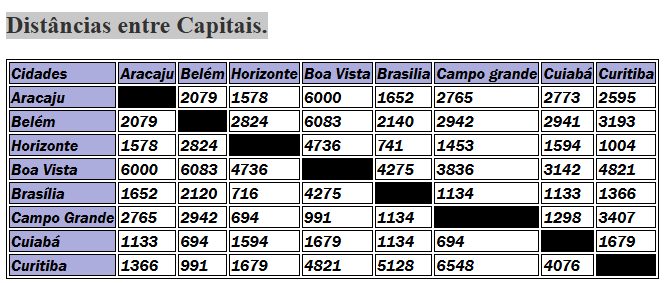

# Projeto - tabela de disancias 

Projeto criado como parte avliativa da Disciplina de Fundamentos de Desenvolvimento  ministrada pelo professor leonardo Rocha.

### Descricao

O projeto consiste na composição  de uma tabela que conta com capitais brasileiras e a distância entre essas capitais. As capitais constantes nesse projeto são
 
* Cidades
* Aracaju
* Belém
* Horizonte
* Boa Vista
* Brasilia
* Campo grande
* Cuiabá
* Curitiba

### Resultado do projeto

### table

* Table - O table consiste um table, com linhas e colunas para melhor visualiza
* Tr - Cria linhas, separando as células da tabela.

Também foi usado:

## Índice

 * [Descrição](#descrição)
 * [Tecnologias](#tecnologias)
 * [Referências](#referências)
 * [Autor(a)](#autora)

## Tecnologias

* HTML5
* css3
* readme
* git
* github

## Referências

[Alura](https://www.alura.com.br/artigos/escrever-bom-readme) - Como escrever um README incrível no seu Github

## Autor(a)

O projeto foi desenvolvido pelo grupo:
 
* Ana Julia Oliveira Viana
* Isabelly dos Reis Santos
* Larissa Aparecida Iuski
* Maria Luíza Farias da Silva
* Mariane Lima Remonte Viana
* Vitor Gabriel de Souza
* Vivian Oliveira Almeida
